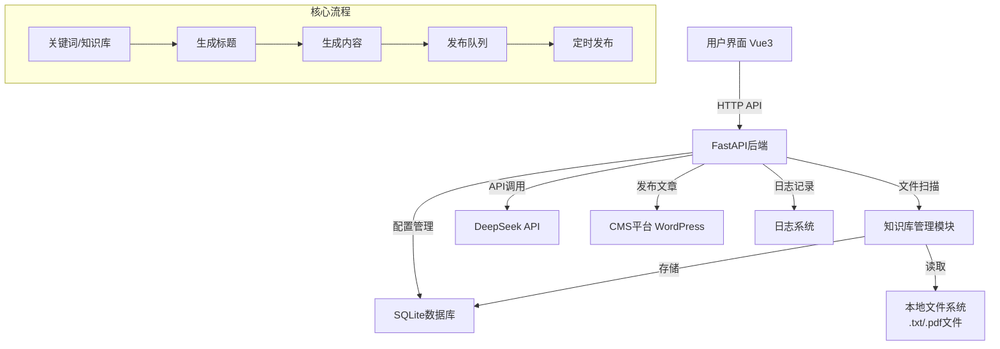
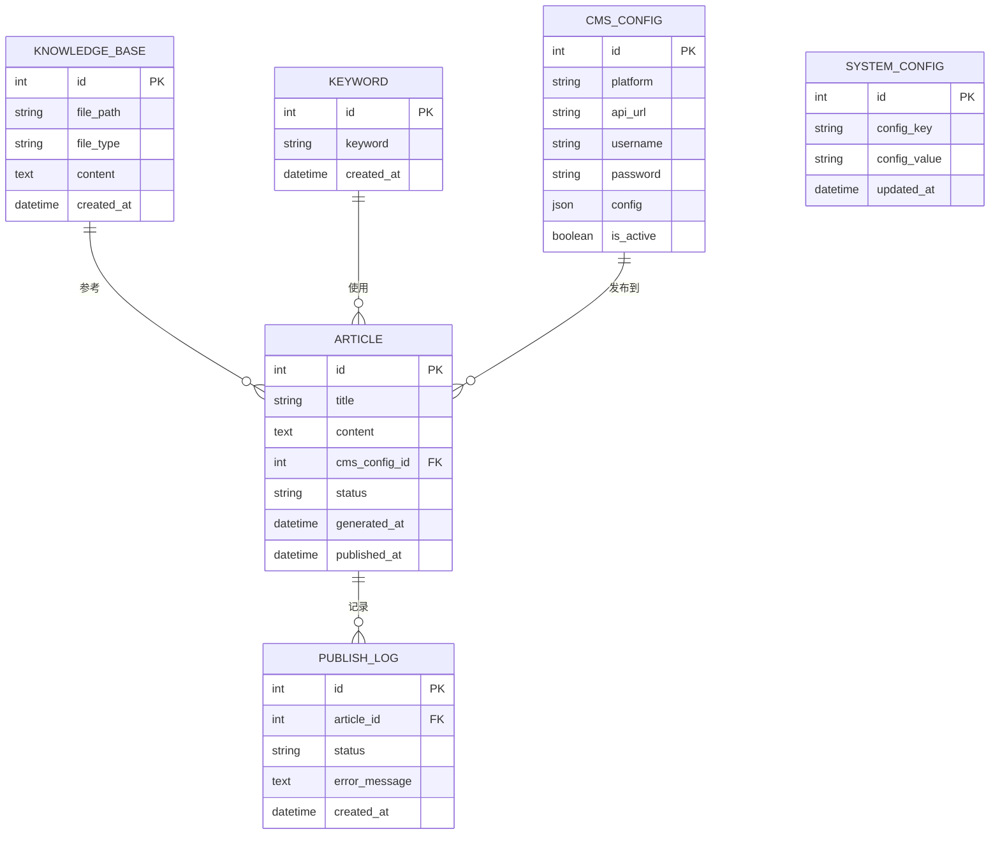

# AI文章自动生成与发布系统 - 项目设计文档

## 系统架构

## 数据库ER图

## 接口清单

### 知识库管理模块 (KnowledgeBaseController)

- `POST /api/knowledge-base/scan` - 扫描指定文件夹，提取.txt和.pdf文件内容
- `GET /api/knowledge-base/list` - 获取知识库列表
- `DELETE /api/knowledge-base/{id}` - 删除知识库条目
- `GET /api/knowledge-base/{id}` - 获取知识库详情

### 关键词管理模块 (KeywordController)

- `POST /api/keywords` - 添加关键词（支持批量）
- `GET /api/keywords` - 获取关键词列表
- `DELETE /api/keywords/{id}` - 删除关键词
- `PUT /api/keywords/{id}` - 更新关键词

### CMS配置模块 (CMSController)

- `POST /api/cms/config` - 创建/更新CMS配置
- `GET /api/cms/config` - 获取CMS配置列表
- `GET /api/cms/config/{id}` - 获取指定CMS配置
- `DELETE /api/cms/config/{id}` - 删除CMS配置
- `POST /api/cms/test-connection` - 测试CMS连接

### 文章生成模块 (ArticleController)

- `POST /api/articles/generate` - 生成文章（需要关键词或知识库）
- `GET /api/articles` - 获取文章列表
- `GET /api/articles/{id}` - 获取文章详情
- `POST /api/articles/publish-all` - 一键发布所有文章
- `POST /api/articles/{id}/publish` - 发布单篇文章
- `PUT /api/articles/generation-config` - 更新生成配置（数量、频率）

### 系统配置模块 (ConfigController)

- `GET /api/config/deepseek` - 获取DeepSeek配置
- `PUT /api/config/deepseek` - 更新DeepSeek配置
- `GET /api/config/generation` - 获取生成配置
- `PUT /api/config/generation` - 更新生成配置

### 日志模块 (LogController)

- `GET /api/logs` - 获取操作日志列表
- `GET /api/logs/{id}` - 获取日志详情

## UI/UX 规范

### 主色调
- **主色**: `#409EFF` (Element Plus 默认蓝)
- **成功色**: `#67C23A`
- **警告色**: `#E6A23C`
- **危险色**: `#F56C6C`
- **信息色**: `#909399`

### 字体规范
- **主标题**: 20px, 600 weight, `#303133`
- **副标题**: 16px, 500 weight, `#606266`
- **正文**: 14px, 400 weight, `#606266`
- **辅助文字**: 12px, 400 weight, `#909399`

### 卡片与布局
- **卡片圆角**: 8px
- **卡片阴影**: `0 2px 12px 0 rgba(0, 0, 0, 0.1)`
- **间距系统**: 8px / 16px / 24px / 32px
- **容器最大宽度**: 1200px
- **背景色**: `#F5F7FA`

### 交互反馈
- **按钮Hover**: 透明度变化 + 轻微阴影提升
- **Loading状态**: Element Plus Loading组件
- **Toast提示**: Element Plus Message组件
- **表单验证**: 实时验证 + 错误提示

### 页面布局
- **顶部导航栏**: 固定高度 60px，背景白色，带阴影
- **侧边栏**: 宽度 200px，可折叠
- **主内容区**: 左右padding 24px，上下padding 20px
- **卡片间距**: 16px

## 技术栈

### 后端
- Python 3.11+
- FastAPI
- SQLAlchemy (ORM)
- PyPDF2 / pdfplumber (PDF解析)
- requests (HTTP客户端)
- apscheduler (定时任务)
- python-dotenv (环境变量管理)
- uv (依赖管理)

### 前端
- Vue 3 (Composition API)
- Vite
- Element Plus
- Axios
- Pinia
- SCSS

### 数据库
- SQLite (开发环境，可扩展为PostgreSQL/MySQL)

### 部署
- Docker
- Docker Compose
